# fungo split keyboard v1.0.
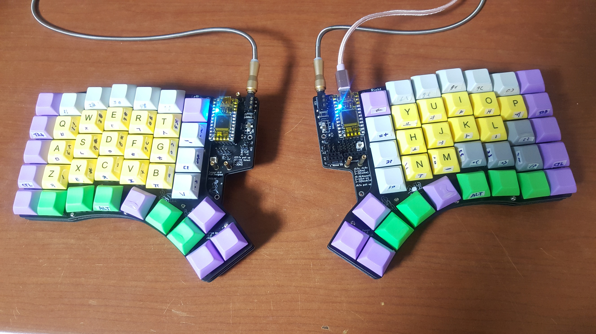

## fungo split keyboard 는
기계식 스위치를 사용하고 qmk, zmk 사용을 기반으로 하는 분리형 키보드. 

## 왜 만들었을까?

실력 없는 늙은 개발자.

오래 일할 땐 손가락, 손목 통증 때문에 20년 넘은 PS2 타입 삼성 키보드를 사용했었다.

어쩌다 분리형 키보드가 있는 것을 보고 구해보려고 했는데 웬걸?

너~무 비싸기도 하거니와 키 배치도 맘에 드는 것이 없어.

그래서 할 수 없이 없는 실력 끌어모으고 옛 기억 더듬어서 새로 만들기로 했어.

**없는 실력에 만드느라 힘들었는데 그런데로 쓸만함. 다이오드 납땜만 아니었으면...**

## 개요 
- 좌우 각 38key(5x7+3)로 구성됨.
- 체리스위치, 카일스위치 부착가능, 핫 스왑 가능
- 검지 손가락에 3줄의 키를 할당함.
- 제일 아래줄은 엄지 손가락을 펼쳐서 사용할 수 있도록 곡선으로 배치
- 리튬 폴리머 배터리 전원 스위치 추가(nicenano 사용할 경우)
- 리튬 폴리머 배터리 연결 단자 추가(nicenano 사용할 경우)
- 마우스 추가를 위한 spi 통신용 연결단자 추가(오른쪽에만 가능, i2c 불가)
- 왼쪽에만 oled 판넬 추가가능함.
- 설계일 기준 국내에서 모두 구매 가능한 부품으로 구성함.(스위치 구성품 제외)
- qmk 사용시 좌우 통신포트를 사용자가 지정할 수 있음.(tx or rx) 

## 문제점 및 특이사항
- 엄지 손가락으로 입력이 불편한 키 발생함.(여유분으로 사용중)
- 회로 설계 실수로 인하여 마우스 스위치용으로 배치한 연결단자 사용불가.
- 최종 조립시 컨트롤 보드와 기판의 간섭이 발생할 수 있음-컨트롤보드 부착시 최대한 간섭되지 않게 밀어서 설치해야함.
- 다이오드의 납땜 패턴이 smt기준으로 되어 수작업으로 납땜하기에는 어려운 편임-납땜 실력이 좀 있어야 작업가능.(아트웍 작업 실수)
- 좌우 대칭이 아님.
- 카일 스위치는 현재 부착해보지 않음.
- nanonice 보드는 설치해보지 못함(zmk 사용법을 몰라서)

## 주요부품

| 부품 | 수량 | 설명 | 비고|
|:--|:--|:--|:--|
| 상부 pcb | 2 | 스위치 프레임| 주문생산 |
| 패턴 pcb | 2 | 컨트롤러 및 전자부품 설치| 주문생산 |
| 하부 pcb | 2 | 하부 덮개| 주문생산 |
| Kailh PCB Socket - CPG151101S11 | 76 | 체리 스위치 핫스왑 소켓|  체리 스위치 사용할 경우 |
| Kailh PCB Socket - CPG135001S30 | 76 | 카일 스위치 핫스왑 소켓|  카일 스위치 사용할 경우 |
| 스위치 - 1U | 76 | 키보드 스위치 | 모든 규격이 1U |

## 부품
- 판매처 : 디바이스 마트

| 부품 | 수량 | 설명 | 비고|
|:--|:--|:--|:--|
| 핀헤더 HD200-40핀 (2mm), 사각핀  | ? | 점퍼용 | 필요한 크기로 잘라서 사용, 필요한 위치에만 사용가능|
| 핀헤더소켓 Single Straight(2.54mm), 사각핀용  | ? | 마우스 외부연결| 필요한 크기로 잘라서 사용, 필요한 위치에만 사용가능|
| 양방향 핀헤더 Single 40Pin (2.54mm), 원형핀용| ? | 컨트롤 보드 연결용 | 컨트롤 보드를 교체형으로 할때에만 필요|
| 53047-02 소켓 | 2 | 리튬폴리머 배터리 소켓 | nanonice 컨트롤러 사용할 경우 |
| 마이크로 슬라이드 스위치 [NW3-SK-02] | 2 | 배터리 전원 스위치 |nanonice 컨트롤러 사용할 경우|
| 1N4148WS (SOD-323) | 76 | 각 스위치에 | 납땜 실패를 고려해서 여유있게 |
| ITS-1107 | 2 | TACT 스위치 | 컨트롤러 리셋 |
| DS1027 -점퍼(OPEN) pitch:2mm  | 3~11 | 컨트롤러 포트 설정 | 최소3개 이상이면 외부 마우스 연결없이 사용가능|
| 십자둥근머리 M2x4  또는 M2x5 | ? | 황동2파이 고정용 | 필요한 만큼 |
| lcd서포트 황동2파이 F-7mm  | ? | 패턴 pcb관통하여 상,하판 연결 | 필요한 만큼, 8mm가 있을 경우 8mm 추천 |
| lcd서포트 황동2파이 F-15mm | 8 | 컨트롤러 덮게 아크릴 고정용 | 덮게 사용할 경우만 |
| NT-B10-FOOT  | ? | 미끄럼방지용 | 필요한 수량만큼 |

## 부품
- 판매처 : 엘레파츠

| 부품 | 수량 | 설명 | 비고|
|:--|:--|:--|:--|
| 폰잭 PJ320D SMD | 2 | AUX 케이블 연결용 | nanonice  사용할 경우 불필요|
| 310-87-164 Straight Socket Connector 64pin 2.54mm, 원형핀용  | ? | 컨트롤 보드 연결용 |컨트롤 보드를 교체형으로 할때에만 필요|
| coms 스테레오케이블(3.5/4극) NT940 | 1 | 좌우 키보드 데이터 전송용 | 원하는 제품으로 변경가능|
| 리튬폴리머 tw-501230 배터리 | 2 | 블루투스를 위해서 |nanonice 컨트롤러 사용할 경우, 배터리 두께는 조정가능|

## 조립
### 다이오드, 1N4148WS (SOD-323)
- pcb의 납땜용 패턴이 smt 기준으로 작업이되어 매우 면적이 작음. 따라서 손으로 납땜하기가 매우 어려우므로 조심스럽게 해야함.
- 다이오드 자체도 매우 작음.
- 초보자의 경우 많은 연습이 필요함.

**절대 쉽게 보면 안되고 납땜후 냉납여부를 반드시 확인해야함, 세척하고 확인을 여러번 할 것을 권장**

.jpg)
.jpg)

- 납땜 되어있는 상태, 너무 작어서 잡기도, 고정하기도 땜하기도 힘들다. 노안이면 더 어려움 ㅠ.ㅠ
- 확대경, 핀셋, 카메라 확대경 등 다 동원했으나 제자리에 놓는것 자체가 힘들었다. 맨눈으로는 힘들것...
- 현재 사용하고 있는 키보드의 상태.

.jpg)

### 핫스왑 소켓, Kailh PCB Socket - CPG151101S11 또는 Kailh PCB Socket - CPG135001S30
- 키보드 스위치를 교체할 수 있도록 소켓을 사용하였으며 체리mx, 카일Choc 스위치중 원하는 제품으로 가능.
- 핫스왑 소켓을 사용하므로 스위치는 5핀(스위치 단자2개, 고정핀3개)이 있는 제품으로 추천.
- pcb에 mx로 인쇄된 부분에 체리용 소켓을, 1350으로 인쇄된 부분에 카일용 소켓을 설치.
- 소켓 납땜시 PCB에 완전히 밀착시켜야 함, 들뜨거나 기울어져 납땜되면 스위치조립이나 케이스 조립시 안맞을 수 있음.
- 체리, 카일 스위치 두 개를 사용하므로 소켓및 스위치 핀의 유격이 약간 있음(두 종류의 스위치의 핀 형상이 다름).
- 체리 MX 스위치는 현재 사용중이나 카일 스위치는 아직까지 최종 조립해보지 않음.

납땜하지 않고 끼운 상태임, swr62:체리스위치용, swr45:카일스위치용

납땜하지 않고 끼운 상태임, 위:체리스위치용, 아래:카일스위치용

체리 mx 스위치

### 컨트롤러 보드
- pro micro, elite-c, nicenano(블루투스) 보드를 사용할 수 있다.
- elite-c 보드를 위한 추가 5핀을 위한 단자가 있음(점퍼로 설정가능).
- 컨트롤러 보드를 설치할 때 상부 pcb와 간섭이 발생할 수 있다.(왼쪽의 경우 컨트롤러 왼쪽부, 오른쪽의 경우 컨트롤러 오른쪽부)
- 간섭을 피하기 위해서는 컨트롤러 설치시 tack스위치 방향으로 최대한 밀착해야함. 또는 상부 pcb를 약간 갈아내야 함.
- 컨트롤러 보드는 pcb에 바로 납땜하는 경우와 소켓을 pcb에 납땜하고 소켓에 끼우는 방식을 사용할 수 있다.
- 컨트롤러 보드의 연결 구멍의 크기가 작아 사각형핀은 사용할 수 없으므로 둥근핀을 사용해야 함.
- 소켓:310-87-164 Straight Socket Connector 64pin 2.54mm(엘레파츠), 핀과 소켓이 함께 있음.
- 핀헤더:양방향 핀헤더 Single 40Pin 2.54mm(디바이스마트), 핀이 양방향으로 있음, 컨트롤러 보드에 납땜후 잘라냄.

elite-c 보드에 양향향 핀헤더를 납땜한 후 잘라낸 상태, 양방향 핀헤더의 조립방법은 여러가지로 가능하다.

소켓(위), 양방향 핀헤더(아래)

elite-c 보드와 소켓이 조립되는 상태(아래의 소켓이 pcb에 납땜된다)

elite-c 보드의 추가 포트용(빨간색), nicenano 보드의 배터리 연결단자(보라색), 사진은 오른쪽 키보드임.
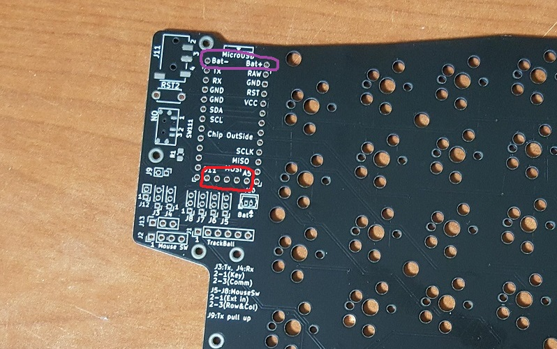

### 점퍼용 핀헤더(피치2mm), 외부 연결용 핀헤더 소켓(피치2.54mm)
- 컨트롤러의 포트를 설정하기 위해서 점퍼를 이용해서 설정함.

**오른쪽 키보드 점퍼핀**
- J12: nicenano 모듈 사용시 raw핀과 배터리 +극을 연결시켜야 할때, nicenano 설명서 확인.
- J9 : 좌,우 키보드 통신용 포트의 풀업저항 사용 - 현재 필요하지 않음.
- J3 : D3번 포트의 설정, 1-2:D3번 포트를 스위치 입력으로 사용, 2-3:D3번 포트를 통신선으로 사용
- J4 : D2번 포트의 설정, 1-2:D2번 포트를 스위치 입력으로 사용, 2-3:D2번 포트를 통신선으로 사용
- J3, J4번 점퍼는 서로 엇갈리게 설정해야함.
- J5~J8 은 elite-c, nicenano의 추가 포트에 대해서 스위치입력 및 외부 연결을 목적으로 했으나 스위치 입력으로 사용할 경우 문제가 있으므로 외부 입력으로 사용해야함.(설계오류)
- J5 : 1-2번만 가능, elite-c 보드의 B7번 포트와 J2 소켓의 1번핀을 연결함.
- J6 : 1-2번만 가능, elite-c 보드의 D5번 포트와 J2 소켓의 2번핀을 연결함.
- J7 : 1-2번만 가능, elite-c 보드의 C7번 포트와 J2 소켓의 3번핀을 연결함.
- J8 : 1-2번만 가능, elite-c 보드의 F1번 포트와 J2 소켓의 4번핀을 연결함.

**오른쪽 키보드 핀헤더 소켓**
- 외부 연결(마우스용 포인팅 장치, 마우스용 스위치)용으로 준비
- J13 : nicenano 보드를 사용할 경우 보드의 추가 포트와 연결용으로 준비(추가 점퍼선 필요), 3개의 포트를 사용할 수 있다.
- J13은 J2의 1, 2, 3번 핀과 연결된다. 또한
- J2 : elite-c의 모든 핀을 사용할 때, nicenano의 추가 3핀을 J13을 연결했을 때 사용할 수 있다.(Mouse SW로 인쇄됨)
- J1 : 마우스 포인팅 장치연결하기 위해서 spi 통신을 위한 4핀, 전원 2핀으로 구성됨. 트랙볼 spi 모듈을 추가할 수 있다.(TrackBall로 인쇄됨)
- J10 : nicenano를 사용할 때 필요한 배터리를 연결하기 위한 잭, 준비한 배터리의 잭 모양과 극성을 반드시 확인해야 함.

오른쪽 키보드로 J3은 2-3번 , J4는 1-2번으로 설정됨

**왼쪽 키보드 점퍼핀**
- J22 : 좌,우 키보드 통신용 포트의 풀업저항 사용 - 현재 필요하지 않음.
- J23 : 좌,우 키보드 통신용 포트의 선택, 1-2:D3번 포트를 사용, 2-3:D2번 포트를 사용
- qmk 펌웨어에서 하나의 펌웨어를 사용할 경우 통신 포트는 같아야 한다.
- J26: nicenano 모듈 사용시 raw핀과 배터리 +극을 연결시켜야 할때, nicenano 설명서 확인.

**왼쪽 키보드 핀헤더 소켓**
- J24 : nicenano를 사용할 때 필요한 배터리를 연결하기 위한 잭, 준비한 배터리의 잭 모양과 극성을 반드시 확인해야 함.
- J21 : OLED 모듈 연결용, 왼쪽에만 oled모듈을 추가할 수 있으며 한쪽만 있을 경우 펌웨어가 지원되는지 알 수 없음.(테스트 해보지 않음)

왼쪽 키보드로 J23은 1-2번으로 설정됨

### 배터리용 스위치, 폰잭
- 스위치는 배터리 차단용으로, 폰잭은 좌우 키보드 통신용으로 사용, 모두 smd타입
- 스위치의 단자가 작으므로 납땜시 다른 부품보다 먼저 하는 것이 유리하다.

### 스위치 프레임 pcb
- 스위치를 끼우는 곳으로체리 mx, 카일Choc 스위치 모두 호환되게 하였으나 카일 스위치의 경우 사용해보지 않아 설치했을 경우 유격은 알 수 없음.
- mx 스위치를 프레임에 끼울 경우 전용 공구 없이 빼기는 매우 어려움.
- 좌,우 구분없이 사용이 가능하다.
- 스위치가 배치되지 않는 공간에 19금 그림이 인쇄되어 있다.(한쪽 면에만 인쇄되어 있으므로 보기 싫을 경우 뒤집어서 사용 가능)

왼쪽, 뒤집으면 오른쪽으로 사용 가능

오른쪽, 뒤집으면 왼쪽으로 사용 가능
.jpg)
왼쪽, 오른쪽 뒷면

### 패턴 pcb
- 전자 부품이 납땜되는 곳으로 프레임 pcb아래에 설치된다.
- 좌,우 패턴이 달라 서로 호환되지 않는다.
- 왼쪽 키보드의 윗면에는 19금 그림이 인쇄되어 있다.

왼쪽 윗면
.jpg)
왼쪽 아랫면

오른쪽 윗면
.jpg)
오른쪽 아랫면

### 하부 케이스 pcb
- 아래쪽 케이스로 사용한다.
- 좌,우 구분없이 사용이 가능하다.
- 19금 그림이 인쇄되어 있다.(한쪽 면에만 인쇄되어 있으므로 보기 싫을 경우 뒤집어서 사용 가능)

.jpg)
.jpg)
.jpg)

### 기타
조립된 상태
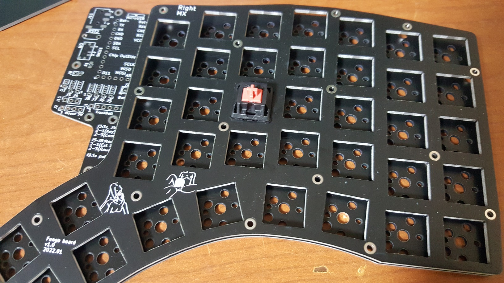

스위치 조립했을 때 뒷면
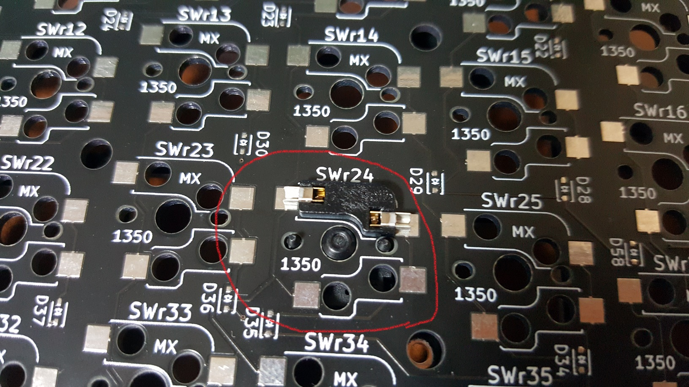

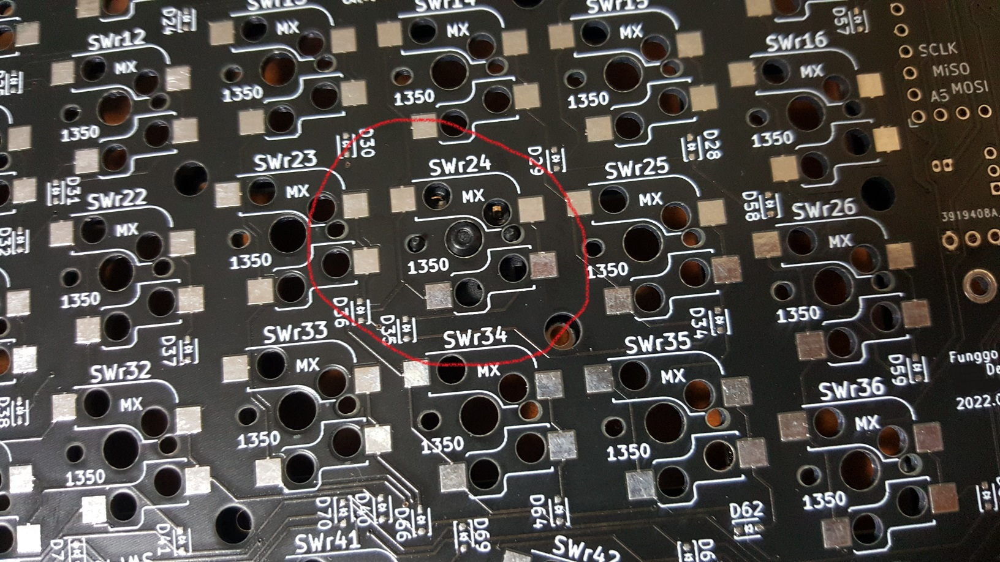

바닥 케이스 pcb에 황동 서포터 조립된 상태
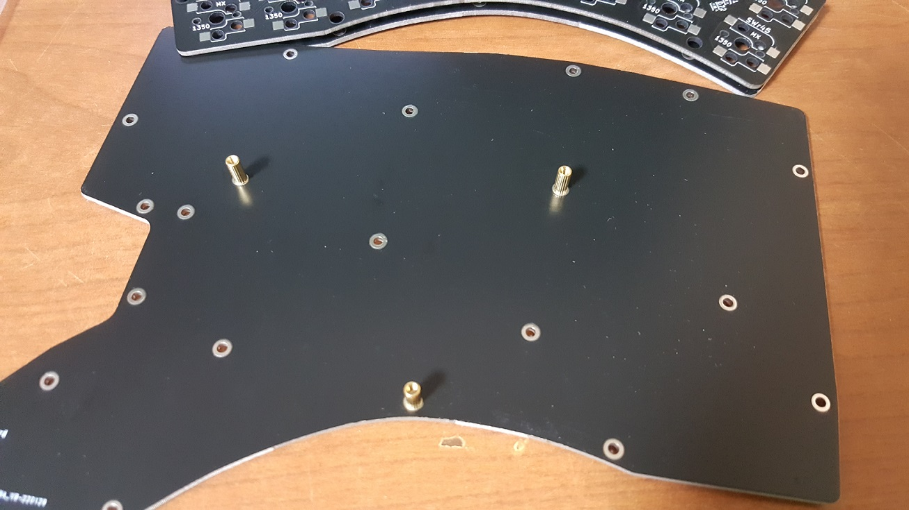

황동 서포터

현재 사용중인 Elite-c 컨트롤 보드에 양방향 핀헤더 납땝한 상태
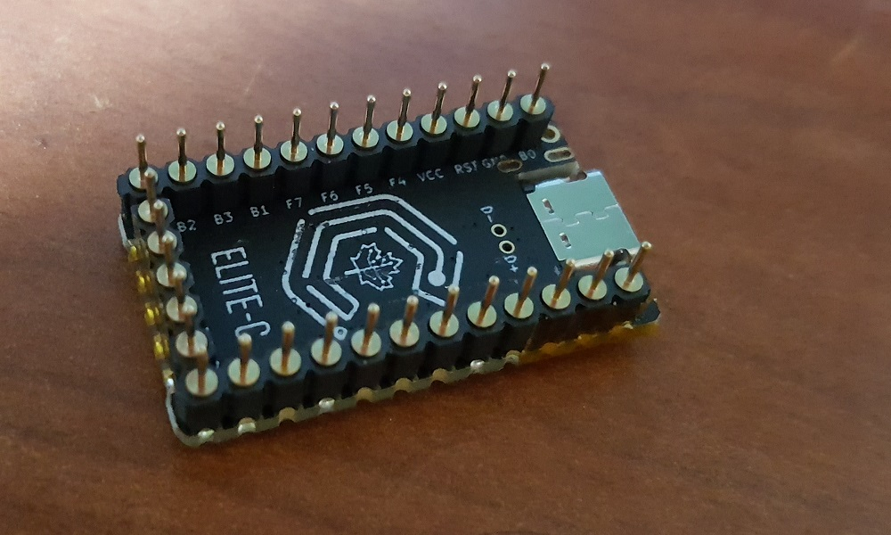

왼쪽 키보드에서 컨트롤러 보드를 제거한 상태, 소켓 커넥트를 사용하여 컨트롤러를 교체형으로 함, 컨트롤러 보드 아래에 배터리를 놓기 위해서 빈 공간에 캡톤 테이프로 채웠음. 빨간색 화살표 부위가 상부 pcb 와 컨트롤러 보드가 간섭을 일어키는 부분.

폰잭

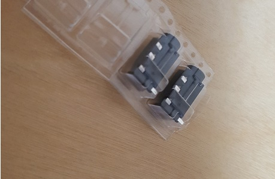

스위치 스왑 소켓

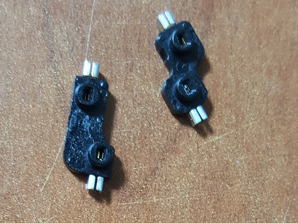

체리 mx 스위치

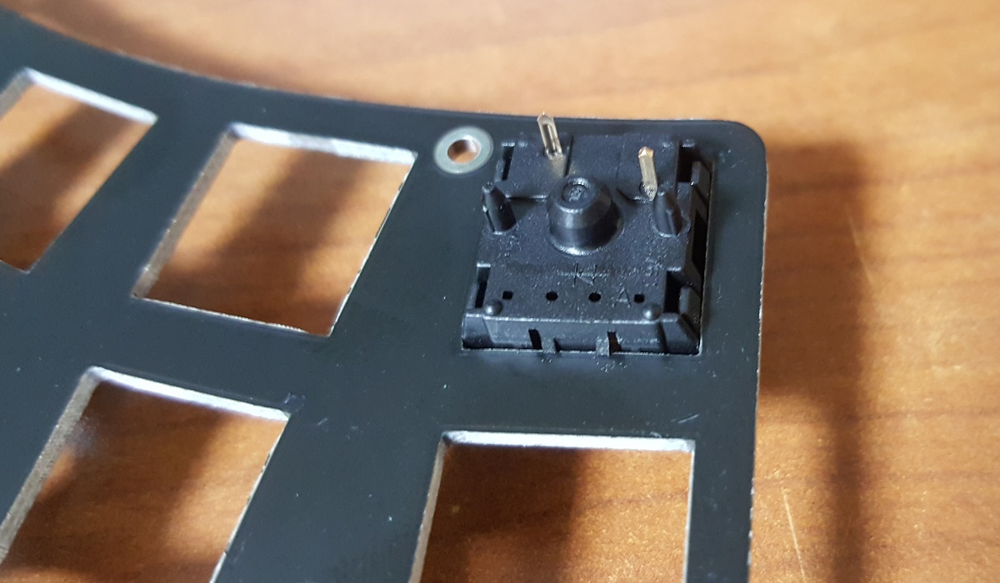
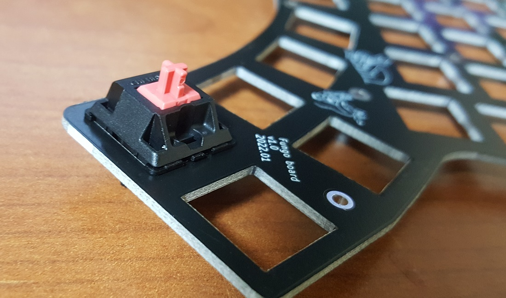
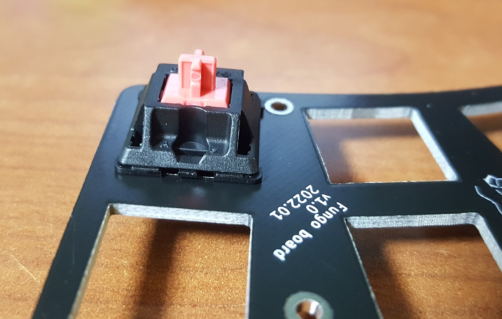

케이스 바닥에 사용한 풋, 미끄럼 방지
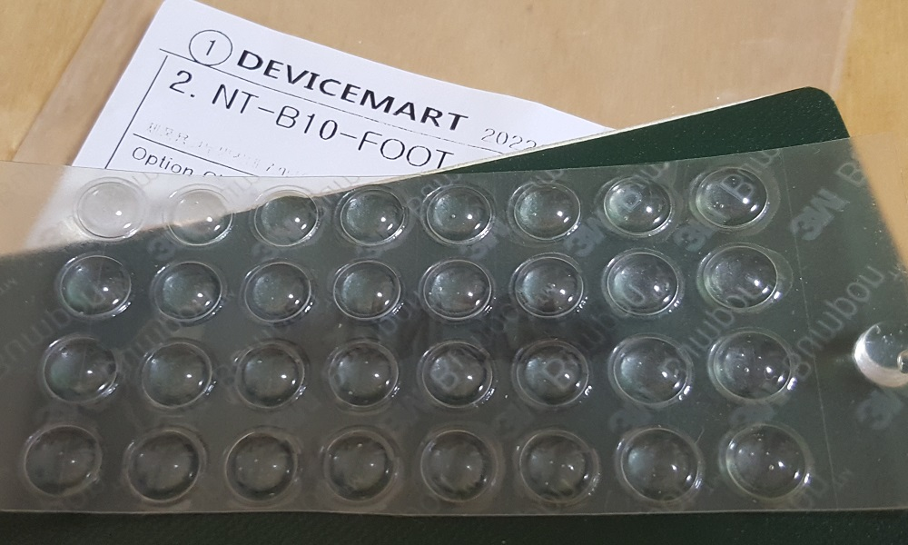

